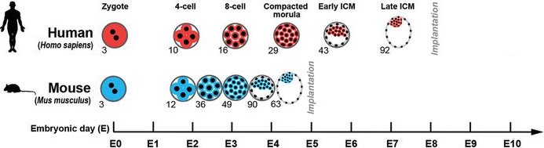

# Shiny app for the visualisation of gene expression during mammalian embryonic development

The aim of this shiny app is to visualise the gene expression dynamics during early embryonic development across different mammalian species. For now I just incorporated mouse and human data sets, but I am open to add other species if someone sends me the data.

   
   Image modified from <a href="https://journals.biologists.com/dev/article/145/21/dev167833/48530/Single-cell-transcriptome-analysis-of-human">this article</a>

<!-- () -->

Link to the app: https://www.bioinformatics.babraham.ac.uk/shiny/shiny_rna_embryogenesis
